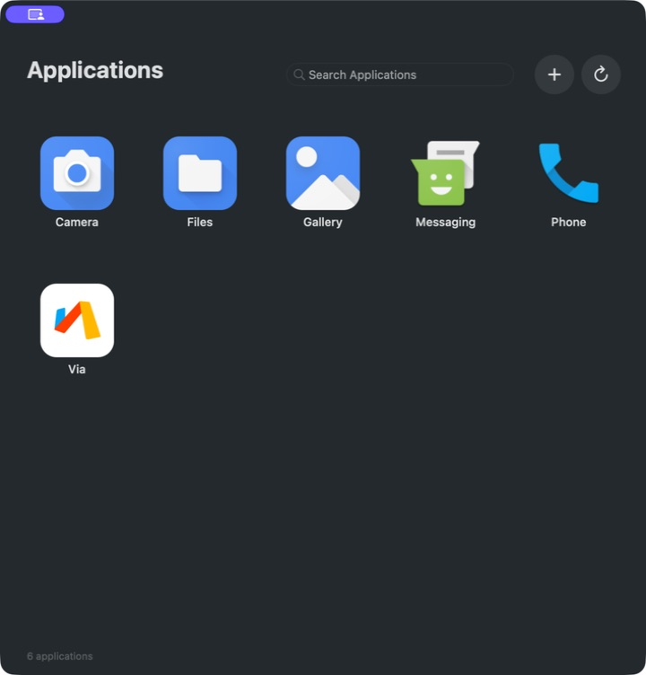

# MacMu

MacMu is a native macOS Android application runtime for Apple silicon, built
from a focused Android Emulator / QEMU core.

MacMu is **not a headless end-user application**. It provides a visible AppKit
launcher and opens Android applications in native macOS windows. Only the QEMU
backend runs without its own window: the upstream Qt emulator UI is removed,
while MacMu renders gfxstream output through IOSurface and Metal.




## Requirements

- Apple silicon Mac (`arm64`).
- macOS 11 or later.
- A supported Android 16 AOSP arm64 image. The image is distributed separately
  from the smaller MacMu application package.

The currently validated guest target is:

```text
product=macmu_sdk_phone64_arm64
device=emu64a
variant=user
target=android-36
```

## First Launch

When no managed image is installed, MacMu waits for a source choice and does
not download anything automatically:

- **Official Image** imports the MacMu-hosted Android 16 image manifest.
- **Other Source…** accepts a complete image ZIP, a local `manifest.json`, or a
  directory containing `manifest.json` and its relative objects.

The official manifest is:

```text
https://storage.macmu.org/images/aosp16-arm64/manifest.json
```

After validation and reconstruction, MacMu installs the image, prepares its
managed AVD, starts Android, and loads the Applications window.


## Documentation

- [Graphics Architecture](docs/GRAPHICS_ARCHITECTURE.md)
- [Android Image Distribution](docs/IMAGE_DISTRIBUTION.md)
- [AOSP Image Build and Validation](docs/AOSP_OFFICIAL_IMAGES.md)
- [Frame Channel v2 Control Plane](docs/FRAME_CHANNEL_V2_CONTROL_PLANE.md)
- [Prebuilt Dependencies](docs/PREBUILTS.md)

## License

The native shell under `shell/` is MIT licensed.

QEMU, gfxstream, Android Emulator, and bundled runtime components retain their
upstream licenses and notices. Keep the generated license and notice files when
redistributing builds.
